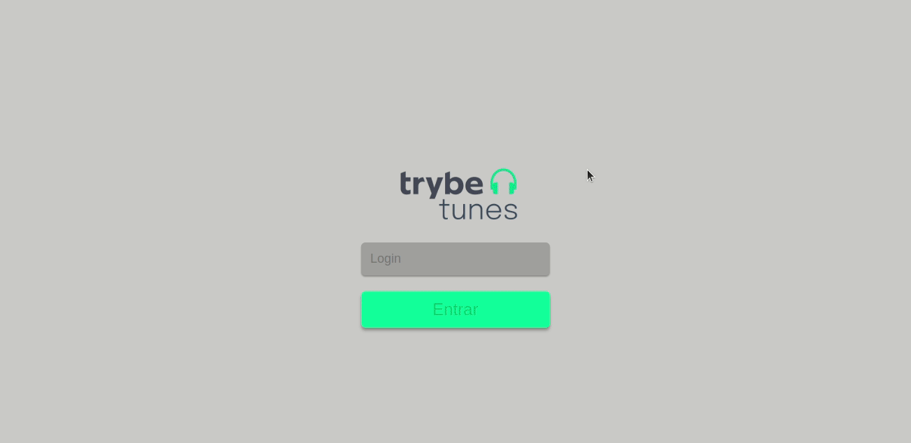

# Projeto Tunes

# Contexto
Este projeto trata-se de um aplicativo de musica onde podemos buscar álbuns dos nossos artistas preferidos e termos uma previa das musicas que consta naquele álbum, os álbuns e as musicas são adquiridas através da API do Itunes.

Esse projeto foi feito como validação do bloco de `Ciclo de Vida de Componentes e React Router` no modulo de `Front-End` da `Trybe`.
<br />



<br />
A aplicação foi construida utilizando React.JS.
<br />
<br />

## **Stacks utilizadas no projeto**
<br />

<a href="https://www.javascript.com/" target="_blank" rel="external"><span><strong>JavaScript</strong></span></a> - Linguagem principal usada.

<a href="https://developer.mozilla.org/pt-BR/docs/Learn/Getting_started_with_the_web/CSS_basics" target="_blank" rel="external"><span><strong>CSS</strong></span></a> - Linguagem utilizada para formatação e estilização da pagina.

<a href="https://react.dev/" target="_blank" rel="external"><span><strong>React.JS</strong></span></a> - O React permite que você crie interfaces de usuário a partir de peças individuais chamadas de componentes.

<a href="https://create-react-app.dev/" target="_blank" rel="external"><span><strong>Create React App</strong></span></a> - Ferramenta de configuração para uma aplicação React.
<br />
<br />

## **Como iniciar o projeto localmente**
<br />
O projeto utiliza a porta (3000) garanta que essa porta não estejam em uso antes de iniciar.
<br />
Primeiro clone o projeto para sua maquina:
<br />

```sh
git clone git@github.com:KleversonEller/Projeto-Tunes.git
```
<br />
Apos clonar o projeto, entre na pasta raiz do projeto `./Projeto-Tunes`:
<br />

```sh
cd Projeto-Tunes
```
<br />
<br />
Para instalar as dependências do projeto utilize o seguinte comando:
<br />

```sh
npm install
```

Esses comando irá instalar as dependências do projeto, pode levar alguns minutos.
<br /><br />

Para rodar a aplicação utilize o comando:

```sh
npm start
```