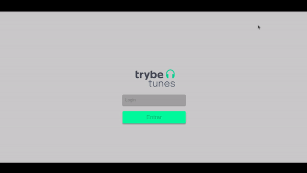
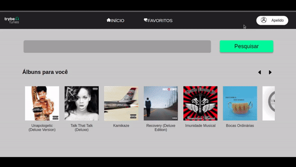
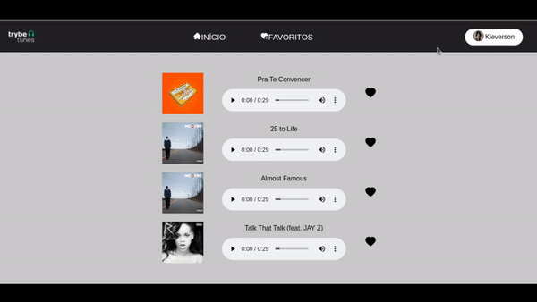

# Projeto Tunes

# Contexto
Este projeto trata-se de um aplicativo de musica onde podemos buscar álbuns dos nossos artistas preferidos e termos uma previa das musicas que consta naquele álbum, os álbuns e as musicas são adquiridas através da API do Itunes.

Esse projeto foi feito como validação do bloco de `Ciclo de Vida de Componentes e React Router` no modulo de `Front-End` da `Trybe`.

A aplicação consiste em uma pagina de `Login`, `Home`, `Profile`, `Profile Edit`, `Álbum`, `Favorite` e `Not Found`:
<br>

## Login
A pagina `Login` consiste em um input de `Login`, e um button `Entrar`.

o campo `Login` conta com uma validação onde deve-se utilizar um apelido de pelo menos 3 caracteres.

O botão `Entrar` permanecera desabilitado enquanto a validação acima não for atendida.


<br>

## Home

### Header
O `Header` da pagina conta com uma `logo`, um `menu de navegação` e um `menu de perfil`.
<br>


O componente `Header` é comum para todas as paginas da aplicação com exceção da pagina `Not Found`.
<br>

### Search
O `Search` conta com um `input` e um `Button` para pesquisar por artistas e um `"Carrossel"` com os álbuns daquele artista.


Inicialmente o `"Carrossel"` é renderizado com uma seleção de álbuns já pré definida.<br>
Ao fazer uma pesquisa valida sera renderizado um novo carrossel com os álbuns do artista pesquisado.<br>
Caso seja feita uma pesquisa com o campo input vazio ou por um artista não existente sera exibido uma mensagem de erro.<br>

## Profile / Profile Edit
A pagina `Profile` contem todas as informações pessoais do usuário e um button `Editar Perfil` que redireciona o usuário para a pagina `Profile Edit` onde o usuário poderá adicionar e editar suas informações pessoais.



## Álbum
Ao clicar em um álbum sera redirecionado para a pagina do álbum escolhido com a lista de musicas daquele álbum com um play para cada musica juntamente com um botão para favoritar a musica.


## Favorite
A pagina `Favorite` e renderizada uma lista com as musicas que foram favoritadas pelo usuário, podem desfavoritar a musica e conta com um play para cada musica.


## Not Found
Ao digitar um endereço invalido sera renderizada a pagina `Not Found` contendo uma mensagem de erro e um link para retornar a pagina inicial da aplicação.



## Técnologias usadas

Front-end:
> Desenvolvido usando: React, CSS3, JavaScript ES6, React Router, API externa.

## Instalando Dependências

``` bash
npm install
``` 
## Executando aplicação

  ``` bash
  npm start
  ```
